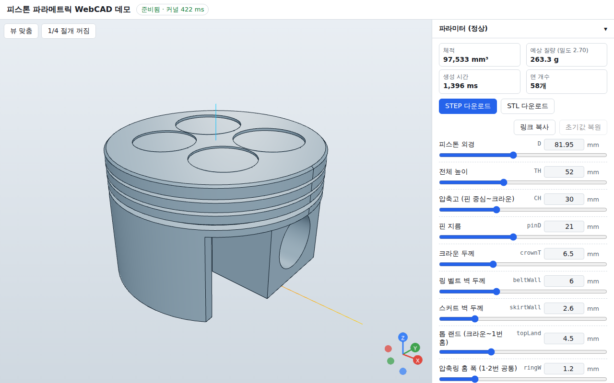

# 피스톤 파라메트릭 WebCAD 데모

브라우저 안에서 CAD 커널(OpenCascade WASM, replicad)이 돌아가고, 숫자만 바꿔 피스톤 3D를 즉시 다시 만들고,
STEP/STL 파일로 내려받는 것이 실제로 되는지 확인하는 **실현 가능성 검증용 데모**입니다. 정식 제품이 아닙니다.
서버·DB·로그인·AI 호출 없이 100% 정적 사이트로 동작합니다.



## 되는 것

- 24개 파라미터(외경·높이·압축고·핀·링 홈·보스·스커트 …)를 슬라이더/숫자 입력으로 바꾸면 300 ms 뒤 자동 재생성
- 3D 뷰어: 면 + 모서리 선, 회전/줌/팬(마우스·터치), 축/기즈모, 자동 카메라 프레이밍, 1/4 절개 보기
- STEP / STL 다운로드 (파일명 예: `piston_D82_CH30.step`), 워커에 캐시된 마지막 성공 solid 를 그대로 내보냄
- 체적(mm³) · 예상 질량(g, 밀도 파라미터) · 생성 시간(ms) · 면 개수 표시
- 규칙 검사 경고 5종을 패널 상단에 빨간 글씨로 표시 (경고가 있어도 생성은 시도)
- 커널 로딩 중 / 생성 중 / 오류 상태 구분, 생성 실패 시 오류 메시지 + 마지막 성공 모델 유지
- 초기값 복원, 파라미터 ↔ URL 쿼리스트링 동기화(링크 복사), 다크/라이트 자동
- 모바일(390 px): 뷰어 위 · 패널 아래, 패널 접기/펼치기

## 실행

```bash
npm install          # .npmrc 의 legacy-peer-deps=true 로 설치됨 (아래 "막혔던 지점" 참고)
npm run dev          # http://localhost:5173
npm run build        # dist/ 생성
npm run preview      # dist/ 를 http://localhost:4173 에서 확인
```

요구: Node 22 (개발 시 v22.22.2, npm 10.9.7). 브라우저는 WebAssembly + Web Worker + WebGL 이 되는 최신 Chromium/Firefox/Safari.

## 검증

```bash
npm run typecheck    # tsc --noEmit
npm run build        # vite build
npm test             # vitest run — Node 에서 wasm 을 로드해 커널 테스트
```

### 최종 실행 결과 (2026-09-05, 이 컨테이너)

`npm run typecheck` — 오류 0 (출력 없음)

`npm run build`
```
dist/index.html                                    0.42 kB
dist/assets/cad.worker-*.js                      264.32 kB
dist/assets/replicad_single-*.wasm            22,980.27 kB │ gzip: 7,234 kB
dist/assets/index-*.css                            4.55 kB
dist/assets/index-*.js                           991.20 kB │ gzip: ~272 kB
✓ built in ~2 s
```

`npm test`
```
 ✓ tests/params.test.ts   (9)   유도값·경고 5종·clamp·파일명
 ✓ tests/urlState.test.ts (3)   URL 쿼리 동기화
 ✓ tests/piston.test.ts   (5)   (1) 기본값 면 ≥ 40 & 체적 80k~120k, (4) 극단값 2세트, 단계 오류
 ✓ tests/export.test.ts   (2)   (2) STEP "ISO-10303-21" & > 50,000자, (3) STL > 10,000
 Test Files  4 passed (4) / Tests  19 passed (19)
```

### 크기와 성능

| 항목 | 값 |
|---|---|
| wasm (`replicad_single.wasm`) | 22,980,267 바이트 (약 23.0 MB, gzip 약 7.2 MB) |
| dist 전체 | 24,241,250 바이트 (약 24.2 MB; wasm 제외 약 1.26 MB) |
| 커널 로드 (헤드리스 Chromium, 로컬 preview) | 약 200–750 ms |
| 기본값 생성 (Node vitest, 형상만) | 약 0.86 s (CPU 여유 있을 때) ~ 1.6 s (부하 시) |
| 기본값 생성 (브라우저 워커, 형상 + 메시 추출) | 약 0.5–1.4 s |
| 극단값 (D=60, TH=35, CH=20) | 약 0.8–1.1 s, 면 92개, 체적 42,909 mm³ |
| 극단값 (D=110, TH=80, CH=50) | 약 0.45 s, 면 58개, 체적 218,850 mm³ |
| STEP 내보내기 | 약 70–110 ms, 234,099 자 |
| STL 내보내기 (바이너리) | 약 120–140 ms, 328,684 바이트 |
| 기본값 결과 | 면 58개, 체적 97,533 mm³, 질량 263.3 g (밀도 2.70), 챔퍼 적용 |

목표(재생성 3초 미만)는 충족. 테스트가 `[perf]` 로 시간을 출력하므로 `npx vitest run --reporter=verbose` 로 다시 잴 수 있다.

### 브라우저 확인

컨테이너에 전역 설치된 Playwright(1.56) + 사전 설치 Chromium(SwiftShader)으로 다음을 확인했다 (앱 의존성에는 넣지 않음).

- dev 서버와 preview 빌드 모두에서 워커가 wasm 을 로드하고 기본값 피스톤이 표시됨 → `docs/screenshot.png`
- STEP/STL 버튼이 `piston_D82_CH30.step` / `.stl` 을 내려받고, 내용이 각각 `ISO-10303-21` / 바이너리 STL 헤더로 시작
- 값 변경(외경 90, 벨트 벽 4) → 경고 표시 + 재생성(체적 110,318 mm³) → 초기값 복원 → 97,533 mm³
- 390 px: 뷰어 위·패널 아래로 쌓이고 가로 스크롤 없음, 패널 접기/펼치기 동작
- `?D=90&valvePockets=0` 로 열면 값이 반영되고 변경 시 URL 이 갱신됨, 1/4 절개 토글, 다크 모드 배경

## Vercel 배포

1. 이 리포를 GitHub 에 두고 Vercel 에서 **Import Project**.
2. Framework Preset: **Vite** (자동 감지). Build Command: `npm run build`, Output Directory: `dist`, Install Command: `npm install` (`.npmrc` 가 legacy-peer-deps 를 처리).
3. Node.js 버전은 22.x 로 지정.
4. 별도 헤더 설정 불필요 — single-thread wasm 이라 COOP/COEP(SharedArrayBuffer) 가 필요 없다. wasm 은 `assets/*.wasm` 정적 파일로 서빙되며 Vercel 이 gzip/brotli 를 적용한다.

## 형상 생성 순서 (src/cad/piston.ts)

1. 몸통 원기둥 R×TH, 크라운 바깥 모서리 챔퍼 0.8 (try/catch, 실패 시 생략)
2. 속 파기: R−skirtWall (0→zBeltBottom), R−beltWall (zBeltBottom→TH−crownT)
3. 슬리퍼 스커트: |x| > xc 영역을 0→zSkirtTop 박스로 cut
4. 핀 보스: 박스에서 로드 자리 박스를 먼저 빼고 몸통에 fuse
5. 핀 구멍: X축 원기둥 (반경 pinR, 길이 D+10, 중심 z=zPin)
6. 링 홈 3개: (R+2 원기둥 − R−depth 원기둥) 링을 해당 z 에서 cut
7. 밸브 포켓 4개 (on): 상면에서 깊이만큼 cut
8. 배유 구멍 4개 (on): 오일 홈 중앙 높이, 60/120/240/300° 반경 방향으로 벽 관통

실패하면 `[단계 N: 이름] …` 형식의 오류를 던지고 UI 는 마지막 성공 모델을 유지한다.

## 한계 (데모라서 하지 않은 것)

- 필렛 없음(스펙상 금지), 챔퍼도 크라운 1곳뿐. 오일 홈 바닥 배유 슬롯이 아닌 단순 원형 구멍.
- 밸브 포켓 위치/지름은 외경 비례 고정값 (사용자 조절 없음).
- 파라미터 조합 검증은 5개 규칙뿐이라, 말도 안 되는 조합(예: 스커트 벽 > 반경)은 단계 오류로 실패한다 (마지막 성공 모델 유지).
- `xc = R·cos(panelAngle/2)` 를 스펙 그대로 구현했다. 기하학적으로 panelAngle 은 ±X 쪽에서 잘려나가는 창의 각도이고, 남는 스커트 판(±Y)의 호는 180°−panelAngle 이다 (DECISIONS.md 참고).
- wasm 이 23 MB 라 첫 로드는 네트워크에 좌우된다 (gzip 7.2 MB). 캐시 후에는 수백 ms.
- 멀티스레드 wasm(`replicad-opencascadejs/multi`)은 쓰지 않았다 (COOP/COEP 헤더가 필요해 정적 호스팅 조건이 까다로워짐).
- 단위 테스트는 Node 에서 커널을 직접 호출한다. 워커/comlink 경로는 Playwright 로만 확인했고 자동화된 e2e 테스트는 리포에 넣지 않았다.

## 막혔던 지점과 해결

| 단계 | 막힌 것 | 해결 |
|---|---|---|
| 1 | `npm install` 이 npm 10.9 arborist 버그(`Cannot read properties of null (reading 'edgesOut')`, vitest 4 의 peer 체인)로 실패 | `--legacy-peer-deps` 로 설치하고 `.npmrc` 에 고정 |
| 1 | 참고 예제는 React 19 + r3f 9 인데 스펙은 React 18 고정 | r3f 8.18 + drei 9.122 + three 0.170 조합 사용 |
| 2 | 워커에서 wasm 로드 | 예제 그대로 `replicad-opencascadejs/wasm?url` + `opencascade({ locateFile })` + `setOC`. Vite 8 이 `node:module` 을 외부화했다는 경고를 내지만 동작에 영향 없음 (dev/preview 모두 첫 시도에 성공) |
| 2 | 메시 각도 허용치 단위 | replicad 는 라디안을 그대로 OCCT 에 넘기므로 15° 를 `15 * DEG2RAD` 로 전달 |
| 4 | 배유 구멍이 중심에서 시작하면 파라미터에 따라 핀 보스를 관통할 수 있음 | 벨트 안쪽 공동(R−beltWall−1)에서 시작해 바깥으로만 관통 |
| 5 | `tests/setup.ts` 의 `node:module` 타입 | `@types/node` 를 dev 의존성으로 추가하고 `/// <reference types="node" />` 로 테스트 파일에만 적용 |
| 6 | 시작 직후 같은 파라미터로 생성이 두 번 돌고, 연속 생성 사이에 "준비됨" 이 깜빡임 | 첫 생성은 디바운스 효과 한 곳에서만(지연 0), 대기열이 있으면 idle 로 바꾸지 않음, 같은 키 재생성은 건너뜀 |

## 파일

```
src/cad/params.ts        파라미터 정의·기본값·범위·유도값·규칙검사 (순수 함수)
src/cad/urlState.ts      파라미터 ↔ URL 쿼리 (순수 함수)
src/cad/piston.ts        형상 생성 8단계 (replicad)
src/worker/cad.worker.ts wasm 1회 로드 + comlink API (init/generate/exportSTEP/exportSTL)
src/worker/api.ts        워커 ↔ 메인 공유 타입
src/worker/client.ts     워커 인스턴스 1개
src/ui/App.tsx           상태·디바운스·대기열·URL 동기화
src/ui/ParamPanel.tsx    슬라이더+숫자 입력, 경고, 초기값 복원, 링크 복사
src/ui/Readout.tsx       체적/질량/시간/면수 + 다운로드
src/ui/Viewer.tsx        r3f 뷰어
src/styles.css           스타일 한 파일
tests/                   vitest (setup.ts 가 wasm 로드)
CLAUDE.md                다음 세션용 규칙 요약
DECISIONS.md             결정 목록
```
